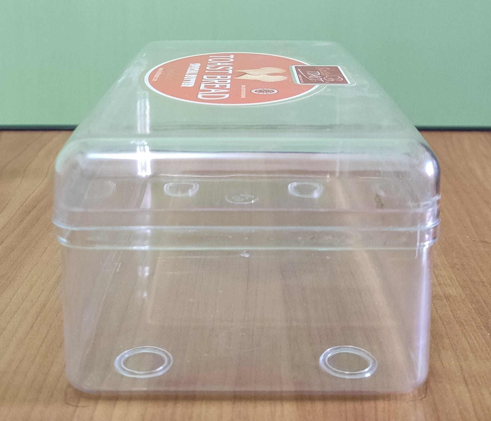
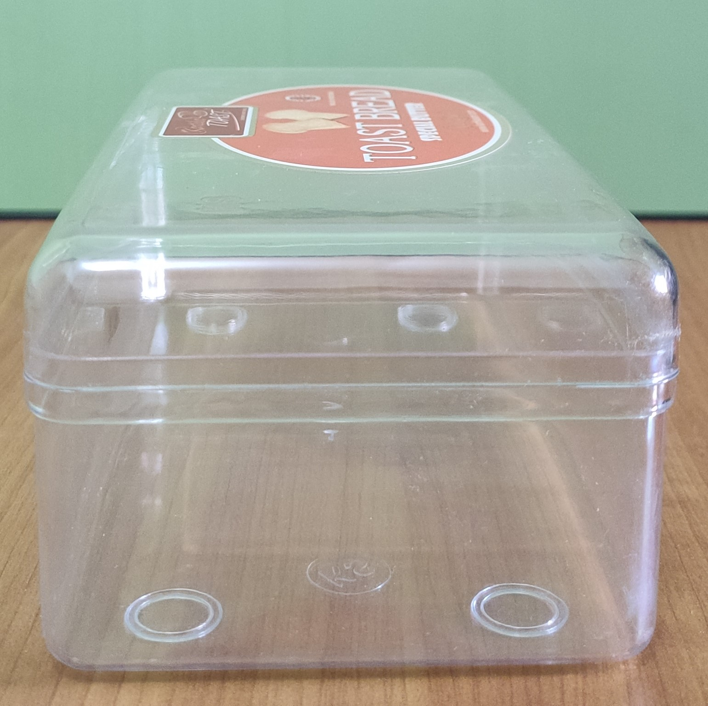
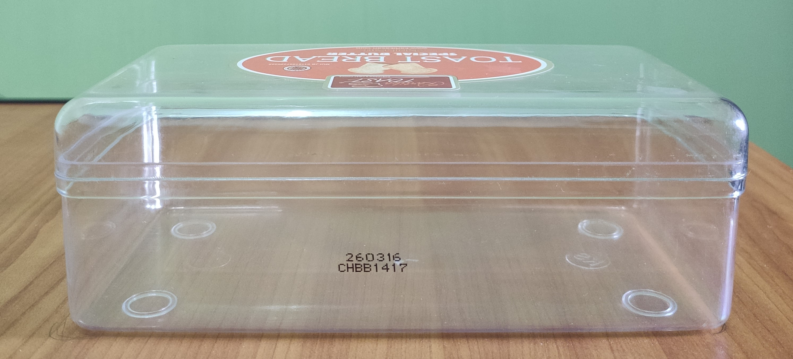
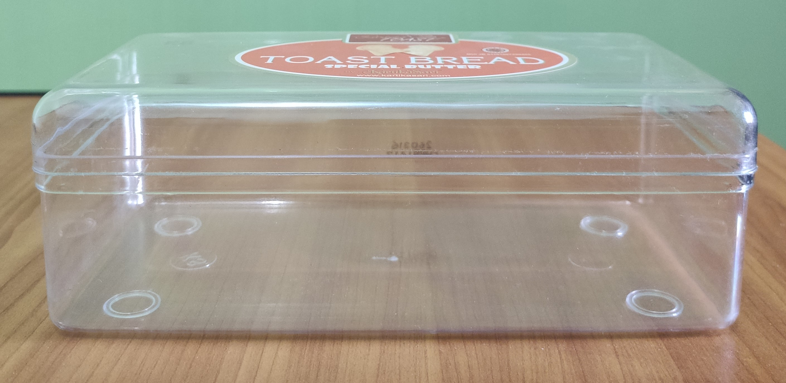

# Jar

## Top Right

## Top Left

## Top Rear

## Top Front

# WebGL-based Graphics application

Using Top Right and Top Front Photo

NB: Please run index.html using HTTP Protocol (e.g. Live Server) because I'm using JavaScript modules and some browsers block .js file modules with certain protocols
